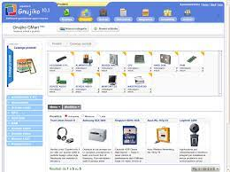

# gnujiko

(IT) fork non ufficiale del progetto [Alpatech Gnujiko](http://gnujiko.alpatech.it/), che sembra non essere più mantenuto

(EN) unofficial fork of the [Alpatech Gnujiko](http://gnujiko.alpatech.it/) project, which seems no longer maintained

## todo
- [x] reperire e mettere online i sorgenti originali / find and commit original source files
- [ ] reperire e mettere online i singoli pacchetti di aggiornamento / find and commit single update packages _(in progress)_
- [ ] farlo funzionare senza problemi su PHP 7.4 / l'applicativo su PHP make it work smoothly on PHP 7.4 _(in progress)_
- [ ] farlo funzionare senza problemi su PHP 7.4 / make it work smoothly on PHP 8.0
- [ ] trovare un nuovo nome per il fork (NewJiko?) e rinominare tutti i file / find a new name for the project (what about NewJiko?) and rename all significant files
